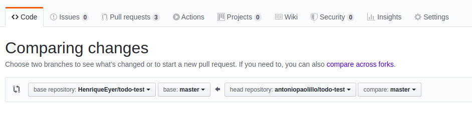

# Boas vindas ao exercício Pokémon Card

---

# Orientações

<details>
  <summary><strong>‼️ Antes de começar a desenvolver</strong></summary><br />

- Crie um fork desse projeto. Para isso, siga esse [tutorial de como realizar um fork](https://guides.github.com/activities/forking/).

- Após fazer o fork, clone o repositório criado no seu computador.

- Rode o `npm install`.

- Vá para a branch main do seu projeto e execute o comando `git branch`

- Mude para a branch  pokemon-card com o comando `git checkout -b pokemon-card`. É nessa branch que você realizará a solução para o exercício.

- Observe o que deve ser feito nas instruções.

</details><br />

<details>
  <summary><strong>🤝 Depois de terminar o desenvolvimento</strong></summary><br />

- Após a solução dos exercícios, abra um PR no seu repositório forkado e, se quiser, mergeie para a master.

⚠ **Atenção!** Quando for criar o PR você se deparará com a seguinte tela:



- É necessário realizar uma mudança. Clique no *base repository* como na imagem abaixo:


- Mude para o seu repositório. Seu nome estará na frente do nome dele, por exemplo: `antonio/exercise-pokemon-card`. Depois desse passo a página deve ficar assim:


- Agora basta criar o PULL REQUEST clicando no botão `Create Pull Request`.

➡ Para cada PR realize esse mesmo processo.

</details><br />

<details>
  <summary><strong>👨‍💻 O que deverá ser desenvolvido</strong></summary><br />

Este repositório contém uma aplicação funcional, que utiliza a [Poke API](https://pokeapi.co/) e traz o nome e a imagem de cada Pokémon, de forma randômica.

Seu objetivo nesse exercício de fixação é utilizar todos os aprendizados sobre testes assíncronos para garantir que aplicações em React com Redux funcionem corretamente.

- Para implementar os seus testes, edite o arquivo `./App.test.js`, que se encontra dentro da pasta src, na raiz do projeto. As configurações necessárias para que os testes funcionem corretamente já estão feitas:
  - O *mock* da função *fetch*, no arquivo `src/__mocks__/mockFetch.js`;
  - O *mock* do retorno da Poke Api, no arquivo `src/__mocks__/pokemon.js`;
  - A função `renderWithRedux`, no arquivo `src/helpers/renderWithRedux.js`.

- Ler, entender a aplicação e saber o que testar também é parte do exercício.

</details><br />

<details>
  <summary><strong>🛠️ Executando os testes</strong></summary><br />

- Para rodar os testes, execute o comando:

```bash
npm run test
```

</details><br />

**Divirta-se codando!** 🚀

---

# Exercícios de Fixação

Todos os testes dos exercícios de fixação deverão ser implementados no arquivo `./src/App.test.js`.

Garanta que você entendeu a implementação da aplicação antes de realizar os testes.

**Dica 1:** O *helper* `renderWithRedux` e os `mocks` do retorno da *API* e do `fetch` já estão criados, basta usá-los em seus testes.

**Dica 2:** Como há requisições para API, vale a pena "esperar" o texto `Loading...` sair da tela, para você fazer os testes (você pode usar o `waitForElementToBeRemoved()`)

## Exercício 1

Neste exercício você deverá testar se, ao renderizar a página, o botão responsável por trazer as informações do próximo Pokémon está presente na tela.

<details>
  <summary>Testes que deverão ser feitos: </summary>

1. Teste se o fetch é chamado uma vez ao carregar a página;
2. Teste se, após a primeira chamada do fetch, o botão de "Próximo Pokémon" está presente na tela.

</details>

## Exercício 2

Neste exercício você deverá testar se a aplicação faz uma requisição para exibir o primeiro Pokémon quando a página é carregada.

<details>
  <summary>Testes que deverão ser feitos: </summary>

1. Teste se o fetch é chamado apenas uma vez ao carregar a página;
2. Teste se o fetch foi chamado utilizando o endpoint de um Pokémon.
    - Você pode utilizar o endpoint do _Froakie_ para construir este teste: `https://pokeapi.co/api/v2/pokemon/656/`

    > **OBS:** A chamada do fetch depende do retorno da função `randomNumber`. Portanto, para testar se o fetch é chamado com um endpoint específico, você deve ser capaz de controlar o valor que é retornado pela `randomNumber`.

</details>

## Exercício 3

Neste exercício você fará os testes básicos para verificar se a renderização é feita corretamente, além de testar que, toda vez que o botão da aplicação é clicado, ele faça uma requisição com dados diferentes para o endpoint.

<details>
  <summary>Testes que deverão ser feitos: </summary>

1. Teste se, após clicar no botão que traz o próximo Pokémon, o fetch foi chamado novamente, mas agora utilizando o endpoint com o número identificador de outro Pokémon.
    - Você pode utilizar o endpoint do _Drowzee_ para construir este teste: `https://pokeapi.co/api/v2/pokemon/96/`
    - Lembre-se de controlar o valor que é retornado pela função `randomNumber`

</details>

## Exercício 4

Neste exercício você deverá testar se os elementos contendo as informações do Pokémon são renderizados.

<details>
  <summary>Testes que deverão ser feitos: </summary>

A tela inicia com um Pokémon renderizado. Com base nisso:

1. Teste se o elemento que exibe o nome do Pokémon está presente na tela. Você pode verificar se o `data-testid=pokemon-name` está na tela.
2. Teste se o elemento que exibe a imagem do Pokémon está presente na tela.
    > Você pode utilizar a [documentação da React Testing Library](https://testing-library.com/docs/queries/about/) para encontrar a query mais adequada para este caso.

</details>
